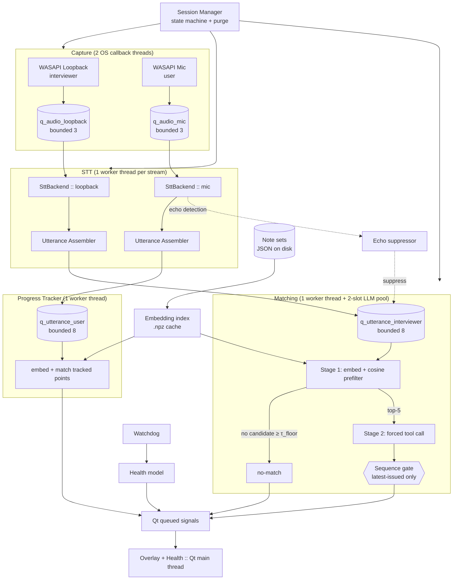
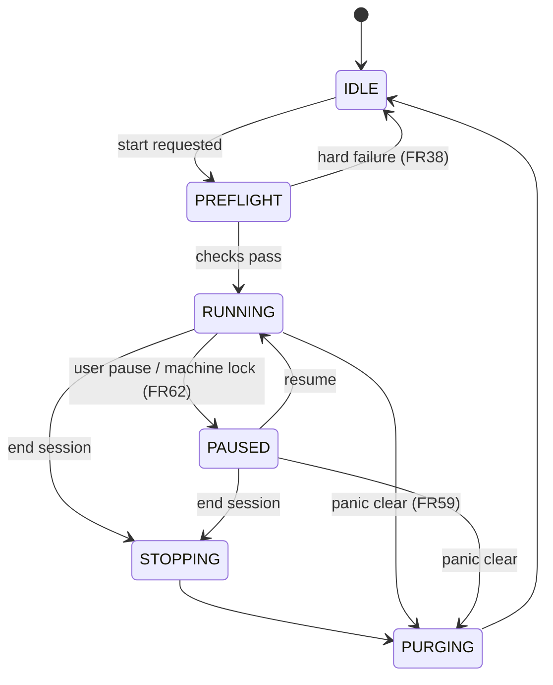

# Technical Design

Cites decisions from [`00-decisions-and-assumptions.md`](./00-decisions-and-assumptions.md) and
requirements from [`01-requirements.md`](./01-requirements.md).

---

## 1. Component Architecture



### Module layout

```
interview_prep_recall/
  app.py                    # entry point, DI wiring
  session/
    manager.py              # state machine (§6), purge, panic clear
    health.py               # health model (§7)
    preflight.py            # FR38 readiness checks
  audio/
    capture.py              # pyaudiowpatch loopback + mic
    devices.py              # enumeration, default-change notifications (FR39)
    echo.py                 # cross-correlation detector (FR57)
  stt/
    interface.py            # SttBackend Protocol + event types (§2) — WRITTEN FIRST
    assembler.py            # utterance assembly (§3)
    local_whisper.py        # faster-whisper backend
    deepgram.py             # cloud backend (own asyncio loop)
    elevenlabs.py           # cloud backend (own asyncio loop)
  notes/
    model.py                # NoteSet / Note dataclasses
    store.py                # atomic write, rotation, schema version (§4)
    importer.py             # chunking, bullet proposal
    index.py                # embedding cache, model-version guard
  matching/
    prefilter.py            # stage 1
    selector.py             # stage 2, forced tool call
    pipeline.py             # sequence gate, debounce, fallback (§5)
  tracker/
    progress.py             # FR12 / FR56
  ui/
    overlay.py              # frameless always-on-top, capture exclusion
    editor.py               # notes CRUD
    settings.py
    indicators.py           # FR20 egress, FR35 health
  diagnostics/
    ring.py                 # FR36 in-memory ring buffer
  platform/
    win_capture_exclusion.py  # SetWindowDisplayAffinity via ctypes
    win_wer.py                # disable WER dumps (FR16)
    credentials.py            # keyring wrapper (FR19)
```

---

## 2. The STT Interface *(D-2 — written before any backend)*

This is the contract BC-4/A8 said was missing. It is specified against the **local** backend's
constraints, because local Whisper cannot provide things cloud backends give for free
(server-side finalization, native interim results), and an interface shaped by cloud would not
be implementable locally.

```python
class SttStreamState(Enum):
    STARTING = auto(); READY = auto(); DEGRADED = auto()
    RECONNECTING = auto(); FAILED = auto(); STOPPED = auto()

@dataclass(frozen=True)
class TranscriptEvent:
    stream_id: str          # "interviewer" | "user"
    text: str
    is_final: bool
    t_start: float          # seconds, monotonic, relative to start()
    t_end: float
    confidence: float | None
    backend: str

@dataclass(frozen=True)
class StateEvent:
    stream_id: str
    state: SttStreamState
    detail: str | None

class SttBackend(Protocol):
    name: str
    supports_interim: bool

    def start(self, stream_id: str, sample_rate: int, channels: int,
              on_transcript: Callable[[TranscriptEvent], None],
              on_state: Callable[[StateEvent], None]) -> None: ...
    def feed(self, pcm: bytes, t_capture: float) -> None: ...
    def stop(self, flush_timeout_s: float = 2.0) -> None: ...
    def close(self) -> None: ...
```

### Semantic contract — binding on every backend

1. **`feed()` never blocks and never raises on transient errors.** It enqueues and returns. A
   backend that cannot keep up drops internally and reports `DEGRADED`. Violating this stalls
   the audio callback and breaks FR45.
2. **Finalization is guaranteed.** Every span of audio the backend acknowledged produces exactly
   one `is_final=True` event, or the stream transitions to `FAILED`. No span is silently dropped.
   (FR47.)
3. **Interim events are advisory.** Backends may emit `is_final=False`; consumers must never
   trigger matching on them. `supports_interim=False` is legal.
4. **Ordering.** For a given `stream_id`, events are emitted in non-decreasing `t_start`.
5. **Clock.** All timestamps derive from `time.monotonic()` at capture time, propagated through
   `feed(t_capture)`. Backends must not use wall-clock or their own arrival time — cloud latency
   would otherwise corrupt utterance boundaries.
6. **`stop()`** flushes pending finals within `flush_timeout_s`, then transitions to `STOPPED`.
   **`close()`** releases resources and is idempotent.
7. **Callbacks run on the backend's own thread.** Consumers must not do heavy work in them; they
   enqueue and return.

**Local backend note (FR47):** `faster-whisper` has no native finalization, so `local_whisper.py`
runs a VAD-based silence detector and synthesizes `is_final=True` at ≥700 ms silence or 10 s max
span. This is the reason the interface defines finalization as a backend responsibility rather
than assuming the wire protocol supplies it.

---

## 3. Utterance Assembly *(D-4 / FR46)*

```
final TranscriptEvents ──► [assembler] ──► Utterance
```

- Accumulate consecutive `is_final` events on a stream.
- Close the utterance on: ≥700 ms gap since `t_end`, OR accumulated span ≥10 s, OR session stop.
- Discard-and-merge-forward if the closed utterance has <3 words or <12 characters (filters "mm",
  "right", "okay" — the dominant source of wasted stage-2 calls).
- Emit `Utterance(stream_id, text, t_start, t_end, context)` where `context` is up to 10 s of
  preceding finalized text on the same stream. **`context` is used only in the stage-2 prompt,
  never in the stage-1 embedding** — including it in the embedding blurs the query and measurably
  hurts prefilter precision.

Rationale for these constants is empirical and they are config-exposed; M4 tunes them against
recorded fixtures.

---

## 4. Data Model *(D-3)*

### On-disk layout

```
%APPDATA%\InterviewPrepRecall\
  config.json                              # thresholds, backend choice, model ID (D-9)
  notesets\<uuid>.json                     # one note set
  notesets\<uuid>.json.bak.1 … .bak.5      # rotation (FR29)
  index\<uuid>.<model_id>.npz              # embedding cache (FR34)
  consent.json                             # FR63 acknowledgement
```

UI geometry/opacity → `QSettings` (registry) per FR26. API keys → Credential Manager per FR19.
**Nothing else is ever written.** The allowlist in the test strategy is derived from exactly this
list plus the PyInstaller temp dir and the `faster-whisper` model cache.

### Note set schema (`schema_version: 1`)

```json
{
  "schema_version": 1,
  "id": "9f2c…",
  "name": "Acme — Senior PM",
  "created_at": "2026-08-08T12:00:00Z",
  "updated_at": "2026-08-08T12:30:00Z",
  "notes": [
    {
      "id": "3a71…",
      "headline": "Tell me about a time you handled conflict",
      "bullets": ["Design review deadlock, Q3", "Ran a written trade-off doc", "Shipped 2 weeks early"],
      "body": "Full prepared answer, verbatim, as the user wrote it…",
      "tags": ["conflict", "leadership"],
      "order_index": 0,
      "track_progress": true,
      "created_at": "…", "updated_at": "…"
    }
  ]
}
```

- `id` — UUID4, stable, never reused (FR41).
- `bullets` — user-authored or user-confirmed verbatim strings (FR42). Empty list is legal and
  triggers the D-6 truncation path.
- `track_progress` — selects membership in the FR12 checklist.

### Embedding cache

`.npz` holding `note_ids`, `vectors` (float32, L2-normalized), `content_hashes`
(SHA-256 of `headline + "\x00" + body`), plus attributes `model_id`, `model_version`,
`embedded_at`.

**Load rule (FR34):** if `model_id`/`model_version` mismatch the running model, discard the cache
and re-embed everything. Per note, if `content_hash` differs, re-embed that note. This closes
BC-1's silent-degradation path — the failure mode where stale vectors are compared against fresh
ones and matching quietly gets worse with no error.

### Atomic write (FR28)

```
tmp = target.with_suffix(".tmp")
write(tmp); flush(); os.fsync(fd); close()
rotate_backups(target)          # .bak.4→.bak.5, … target→.bak.1
os.replace(tmp, target)         # atomic on NTFS
```

Rotation happens *before* replace so a crash mid-rotation loses at most one backup generation,
never the live file.

---

## 5. Matching Pipeline *(§5 of requirements)*

```
Utterance(interviewer)
  → embed (all-MiniLM-L6-v2, normalized)
  → cosine vs active-set vectors
  → candidates = top-5 where sim ≥ τ_floor
  → if empty:  emit NoMatch                                    [FR50]
  → else:      seq = next_sequence(); dispatch stage 2         [FR32]
                 ↓
       forced tool call, enum = [*candidate_ids, "none"]        [FR48]
                 ↓
       on success  → if note_id == "none": NoMatch
                     else: Match(note_id, seq, CONFIRMED)
       on failure  → if top_candidate.sim ≥ τ_degraded:
                          Match(top_id, seq, DEGRADED)          [FR49]
                     else: NoMatch
                 ↓
       sequence gate: render only if seq == latest_issued       [FR32]
```

### Thresholds (initial values, tuned in M4)

| Symbol | Default | Meaning |
|---|---|---|
| `τ_floor` | 0.35 | Stage-1 admission. Exposed to the user as the FR52 sensitivity control. |
| `τ_degraded` | 0.55 | Minimum similarity to render a degraded fallback (FR49). |
| `K` | 5 | Max candidates into stage 2 (bounds FR48's enum). |
| `τ_visible` | 25 s | Snippet auto-clear (FR54). |
| `debounce` | 1 in flight | D-11. |

### The sequence gate — precise semantics (FR32)

```python
self._latest_issued: int          # incremented at dispatch
self._rendered: int               # last rendered

def on_result(result):
    if result.seq != self._latest_issued:
        diagnostics.record("stale_response_discarded", seq=result.seq)
        return                    # discard: a newer request already superseded this
    render(result); self._rendered = result.seq
```

Comparing against `_latest_issued` rather than `_rendered` is the correction the PR review
caught. With requests A(1) and B(2) both in flight, a `> _rendered` test lets A render when it
returns first, even though B already supersedes it. Correctness must not depend on cancellation
landing, because a request can complete concurrently with its own cancellation.

### Cost and rate limiting (FR40)

One call per qualifying utterance, at most one in flight, ≤1 retry with backoff on 429/5xx, and a
per-session ceiling (default 400 calls). Exceeding the ceiling degrades to local-only and signals
via FR35 — the user is told, not silently downgraded.

---

## 6. Session State Machine *(D-7)*



**Health is orthogonal**, not a state. A session in `RUNNING` carries a health record (§7); there
is no `RUNNING_DEGRADED` state. This is what keeps the state count at 6 instead of 6×2^5.

### Purge semantics (FR15, FR58, FR59)

`PURGING` executes in this order, and the order matters:

1. Cancel in-flight network work — close the cloud STT socket, cancel the LLM request — **before**
   clearing local state, so nothing in transit outlives the purge (FR59).
2. Stop capture threads; drain and zero audio queues.
3. Zero transcript buffers. Buffers are `bytearray`/`memoryview`, not `str`, precisely so they can
   be zeroed; Python string reassignment does not erase the backing memory (DI-6).
4. Clear overlay content and the matching sequence counters.
5. **Do not touch** note sets, embedding caches, settings, or consent state (FR58).

Any result arriving after step 1 is discarded by the sequence gate, whose counters were reset.

---

## 7. Health Model *(FR35 — the fix for OB-1)*

```python
@dataclass
class Health:
    loopback: Status   # ok | degraded | failed | off
    mic:      Status
    stt:      Status
    matching: Status   # ok | local_only | failed | off
    egress:   Egress   # none | cloud_stt | llm | both
    lag:      float    # seconds behind realtime
```

The single most important property: **`matching=ok` with an empty overlay means "nothing in your
notes is relevant"** (FR50), and it renders differently from every failure state. The PRD's design
made those two visually identical, which is the worst observability property this system could
have — the user cannot distinguish working-as-designed from broken at the moment they most need
to know.

Derived indicator states: `capturing`, `no audio detected (Ns)`, `STT degraded`, `matching:
local-only`, `falling behind`, `audio lost`, `NOT hidden from screen share` (FR14a).

---

## 8. Concurrency Model *(D-1 — the load-bearing decision)*

| Thread | Count | Owns | Blocking allowed |
|---|---|---|---|
| Qt main | 1 | All UI, `QSettings` | Never |
| Audio callback | 2 | PCM copy → bounded queue | Never (FR45, p99 < 2 ms) |
| STT worker | 2 | Backend `feed`/inference, utterance assembly | Yes |
| Matching worker | 1 | Embedding, prefilter, dispatch | Yes |
| LLM pool | 2 | HTTP request/response | Yes |
| Tracker worker | 1 | Mic-side embedding + checklist | Yes |
| Watchdog | 1 | Heartbeats, health, device-change notifications | Yes |

**Rules:**
- Cross-thread delivery into the UI is exclusively via Qt **queued** signal/slot connections. No
  direct widget access off the main thread — a violation here produces intermittent crashes that
  reproduce only under load.
- All inter-stage queues are bounded with drop-oldest (FR33). Nothing in the pipeline is allowed
  to grow with session length.
- The GIL is not a bottleneck for the CPU-bound stages: CTranslate2 (`faster-whisper`) and torch
  (`sentence-transformers`) release it during inference. This is why threads suffice and
  multiprocessing — with its serialization cost on every audio frame — is not needed.
- `asyncio` exists only inside cloud backends, each owning a private loop in its own thread. It
  never leaks into the application's public interfaces.

---

## 9. Failure Handling — Component Degradation Ladder

Implements review §4's ladder. Each row is a test case in the strategy doc.

| Failure | Detection | Response | Signal |
|---|---|---|---|
| Cloud STT drop | socket close/timeout | fall back to local, resume | `local STT (fallback)` (FR21) |
| STT worker crash | watchdog heartbeat | restart once; second failure holds session | `STT unavailable` (FR61) |
| STT falling behind | queue depth > 3 | drop oldest chunk | `falling behind` (FR33) |
| Default device changed | device-change notification | re-bind, continue | brief notice (FR39) |
| Device lost | capture read error | retry 10 s, then pause | `audio lost` (FR39) |
| LLM timeout/error | request exception | retry once → degraded path | degraded styling (FR49) |
| LLM 429 sustained | HTTP status | backoff → local-only for session | `matching: local-only` (FR40) |
| Overlay hang | UI watchdog | recreate window, restore geometry | brief notice |
| Capture-exclusion failure | API returns false | none possible | **persistent warning** (FR14a) |
| Corrupt note set | parse failure | offer backup restore | explicit prompt (FR44) |
| Sleep/lock | power notification | pause, purge nothing, resume | state shown (FR62) |

---

## 10. Dependencies

| Package | Purpose | Risk |
|---|---|---|
| `PySide6` | Overlay, editor, settings, `QSettings` | Low. LGPL. |
| `pyaudiowpatch` | WASAPI loopback + mic | **Highest.** Small community fork of PyAudio; AS-2 validates concurrent dual-stream capture in M1 before anything is built on it. |
| `faster-whisper` | Local STT | Medium. Model download on first run; ~150 MB bundled or fetched. |
| `sentence-transformers` | Embeddings | Medium. Pulls torch — dominates the PyInstaller bundle size. |
| `anthropic` | Stage-2 selector | Low. |
| `keyring` | Credential Manager (FR19) | Low. |
| `numpy` | Vector math, `.npz` cache | Low. |
| `websockets` / `httpx` | Cloud STT backends | Low. Confined to backend modules. |
| `PyInstaller` | Packaging | Medium. One-file extraction is an expected non-content write; the privacy allowlist accounts for it. |

**Platform APIs via `ctypes`:** `SetWindowDisplayAffinity` (FR14), WER dump suppression (FR16),
`IMMNotificationClient` for device-change notifications (FR39).

---

## 11. Explicitly Out of Scope for v1

Acoustic echo cancellation (D-8 warns instead) · true diarization (AS-5) · `.docx` import (FR1b) ·
local LLM matching via Ollama (OQ-4) · multi-monitor-aware default placement beyond FR55 recovery ·
any post-call artifact, per the PRD's non-goals.
